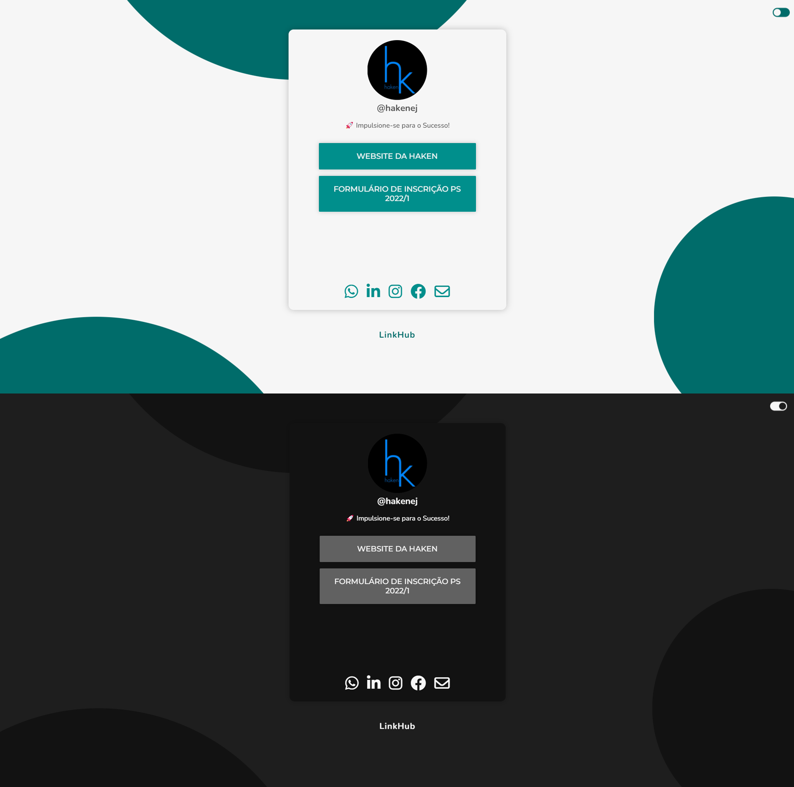
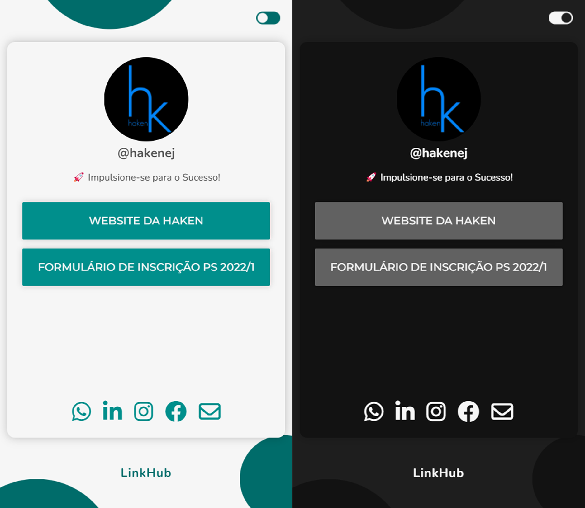

 

<h1>🔖 Sobre</h1>

    <b>LinkHub</b> é o nome de uma empresa fictícia pensado para dar base ao projeto de um site estilo LinkTree, tal que disponibiliza uma seção para os usuários anexarem seus links para sites terceiros tais como redes sociais.

## 🚀 Tecnologias

- [HTML](https://devdocs.io/html/)
- [CSS](https://devdocs.io/css/)
- [JAVASCRIPT](https://devdocs.io/javascript/)

 

## 🖥️ Web View

    

 

## 📱 Mobile View

    

 
 
 

<!-- <table><tr>
<td align="center"><a href="https://github.com/vitorRibeiro7">
 
 
 <b>Vitor Ribeiro</b></a>
 

</td>

</tr></table> -->

 Criado com ☕ por <b>Vitor Ribeiro. </b>

